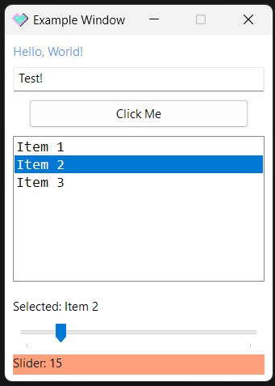

## Win32 Simple GUI for C#/.NET

The most lightweight embeddable GUI framework for Windows.

It's literally just some managed bindings around Win32 APIs, like the good old days.

AOT safe for where WinForms and WPF can't go, directly vendorable for single-file apps, and way smaller binaries than UI frameworks like Avalonia.

Look, it won't be pretty, but it's the Laziest™ and "Simplest" way to add a GUI to your Windows app.

### Example App

See [Example.cs](example/Example.cs). About 80 LoC with comments & whitespace, 1.1 MB AOT binary. Looks like this:

Comes with basic layout support, so you can even resize it.

### Bugs

Probably, yeah.

### AI Disclosure

Written mostly by GLM 5.3-Flash under my guidance. Look, I'm not building a Win32 wrapper function-by-function myself. I drew the example icon myself though, as you can clearly tell.

### License

MIT. Use it where you like. Let me know if you do something neat with it.